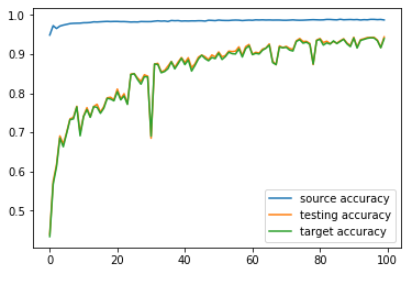

# Domain Adversarial Neural Network in Tensorflow

Implementation of Domain Adversarial Neural Network in Tensorflow.

Recreates the MNIST-to-MNIST-M Experiment.

Tested with `tensorflow-gpu==2.0.0` and `python 3.7.4`.

## MNIST to MNIST-M Experiment
### Generating MNIST-M Dataset

> Adapted from [@pumpikano](https://github.com/pumpikano/tf-dann/blob/master/create_mnistm.py)

To generate the MNIST-M Dataset, you need to download the [BSDS500](https://www2.eecs.berkeley.edu/Research/Projects/CS/vision/grouping/resources.html#bsds500), and place it in `./Datasets/BSR_bsds500.tgz`. Run the `create_mnistm.py` script.

Alternatively, the script `create_mnistm.py` will give you the option to download the [dataset](http://www.eecs.berkeley.edu/Research/Projects/CS/vision/grouping/BSR/BSR_bsds500.tgz), if it is not found in the directory.

    python create_mnistm.py

This should generate the `./Datasets/MNIST_M/mnistm.h5` file.

### Training

Run the `DANN.py` script.

    python DANN.py

Uncomment the `#train('source', 5)` to use Source-only Training

### Results
> Note: The architecture and hyper-parameters do not match the ones used in the paper

The Testing Accuracy over MNIST-M [Target Dataset] reaches over ~94% over 100 epochs, as compared to the 76.66% mentioned in the paper.

* Source Accuracy : Self Accuracy Score over MNIST (used for Training)
* Testing Accuracy : Accuracy Score over Testing Set of MNIST-M [Target Dataset]
* Target Accuracy : Accuracy Score over Training Set of MNIST-M [Target Dataset]

## References

Ganin, Y., Ustinova, E., Ajakan, H., Germain, P., Larochelle, H., Laviolette, F., ... & Lempitsky, V. (2016). Domain-adversarial training of neural networks. The Journal of Machine Learning Research, 17(1), 2096-2030.

 * http://jmlr.org/papers/volume17/15-239/15-239.pdf
 * For more information, see http://sites.skoltech.ru/compvision/projects/grl/
